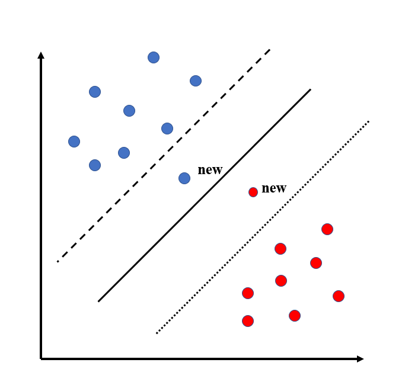

# SVM的路线梳理。

&ensp;内容包括SVVM学习过程中常见的各种名词概念之间的关系和逻辑线。包括**线性可分，线性不可分，核函数，特征空间映射，hinge loss函数，最小序列最优化方法，希尔伯特空间，对偶问题**等的各种高大上的概念。这些概念都将在本篇博文中得到串联和阐释。

&ensp;首先介绍一下svm是一个很强大的分类器，在deep learning还没有一统江湖的时候，svm绝对是那个时代的机器学习的顶梁柱，即便是现在，虽然deep learning如火如荼，SVM的重量级地位依然不容小觑，而且SVM作为基本的机器学习算法，有很多学习和优化的思路值得借鉴，搞懂SVM对面试和日常工作来讲都是非常重要的。

## 从感知器开始讲起

&emsp;在介绍SVM之前首先要提一下感知器，感知器在Hinton的coursra课程上有过讲解，在李航的统计学习方法中也有具体的描述，用一句话表达感知器就是：用于找到线性可分数据的一个分类平面的算法。 也就是说感知器本身解不唯一，如果我们对比这些解的话，哪个解是最佳的解呢？那恐怕就要从机器学习的问题本身出发来看待了。必须要认识到的问题是我们找到了一个分类平面不是我们的最终目的，学习的目的在于预测，也就是说对于不在训练数据集中的样本，分类器分类效果的优劣应该是一个分类器好还是坏的评判标准。 那么对于感知器而言，一个距离正负样本的距离都很远的分类平面就应该是一个好的分类平面，因为对比那些正确分了类但是很靠近某一类的分类平面而言，一个新的样本来了，如果它是一个稍微远离正例的正样本，它也不容易被划到负样本那一侧去，对于稍微远离负例的负样本也是如此。于是我们脑海中最优分类平面的概念就建立起来了。如下图所示，三个平面都可以讲原始训练数据分开，但是对于新来的样本点，显然中间的更加具有区分能力，而另外两个会有错分的现象。

&emsp; 于是我们潜意识地大约知道了什么样的分类平面是比较优的，但是如何把这个现实中的语义建模成数学的呢？，这就需要用到间隔和距离的概念了。

&emsp;我们知道，当我们刻画一个平面为最优平面的时候，我们是有着远和近的概念在这里面的，对应到数学模型的概念上就是距离和间隔，于是，我们需要从距离入手，找到刻画最优平面的方式。首先要介绍的是函数间隔的概念：给定超平面$(w, b)$，以及样本点$(x_i, y_i)$，定义样本点到超平面的函数间隔为：

$\hat{\gamma }_i = y_i(w\cdot x_i + b)$